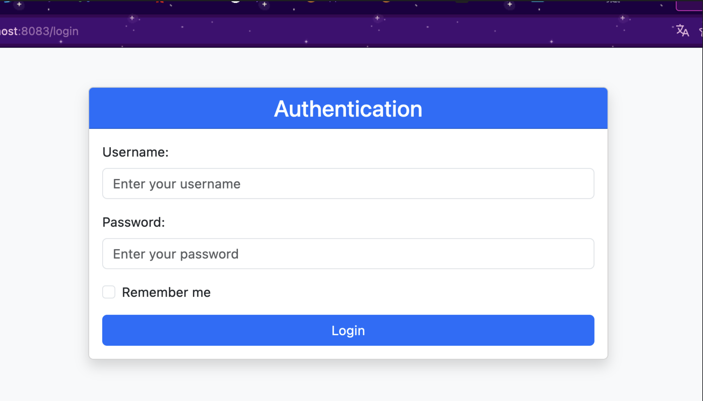

#                            Rapport de Fonctionnement du Projet

## Introduction
Le présent rapport documente le fonctionnement du projet , un système de gestion des patients 
doté d'une interface de login sécurisée. Le système vise à offrir une gestion efficace des 
informations relatives aux patients, en fournissant différentes fonctionnalités selon le rôle 
de l'utilisateur connecté.

## Fonctionnalités Principales

1. Interface de Login
    Le système démarre par une interface de login requérant le nom d'utilisateur et le mot de passe.
    Cette mesure de sécurité garantit que seuls les utilisateurs autorisés peuvent accéder aux 
    fonctionnalités du système.
   
2. Fonctionnalités Administratives
   - Si l'utilisateur connecté possède le rôle d'administrateur, des fonctionnalités supplémentaires
   deviennent accessibles. L'administrateur peut ajouter, supprimer, modifier des entrées de 
   patients et effectuer des recherches avancées dans la base de données. Ceci offre un contrôle 
   complet sur la gestion des informations patients.
   - Une fois authentifié, l'utilisateur est redirigé vers une interface présentant une liste complète
   des patients. Cette liste inclut des informations cruciales telles que le nom, la date de naissance,
   le score du patient, et son statut de santé.
     
  - Pour ajouter un patient l'utilisateur appuie sur patient en haut dans la barre ensuite sur nouveau.
    
  - Ensuite il rempli les champs (nom,date de naissance,score et malade) et il enregistre le patient
    en appuiyant sur le bouton save
    
  - si l'administrateur veut modifier un utilisateur prenons comme exemple celui a l'id=2 on modifie
    les informations et on appuie sur save.
    
  - Et pour supprimer un patient toujours comme exemple celui a l'id=2 on appuie sur DELETE.
    
  - En confirmant la suppression en appuiyant sur ok.
    
  - Et il a la possibilité de rechercher un patient
    
  -Et enfin pour ce deconnecter il appuie sur logout.
    
 
3.Fonctionnalités Utilisateur 

Les utilisateurs avec des rôles standard ont une interface simplifiée, montrant uniquement la liste
des patients. Ils conservent la capacité de rechercher des patients pour accéder rapidement aux 
informations pertinentes.

## Renforcer la Sécurité de l'Application en Implémentant un Système d'Authentification avec Spring Security et les Trois Stratégies Via la Création de la Classe SecurityConfig.
- classe SecurityConfig :
    
  - La classe SecurityConfig sert de pivot central pour la sécurisation de l'application Spring, 
  jouant un rôle crucial dans la définition des stratégies d'authentification, la gestion des
  détails des utilisateurs, et la configuration de la sécurité des requêtes HTTP. Cette classe 
  tire parti d'une approche hybride, combinant des configurations en mémoire avec InMemoryUserDetailsManager 
  et des configurations basées sur une base de données via JdbcUserDetailsManager. 
  Elle va au-delà en spécifiant des règles d'autorisation pour des URL spécifiques, 
  en orchestrant la gestion des sessions, en définissant des redirections en cas d'erreurs d'accès, et en
  configurant UserDetailServiceImpl en tant que gestionnaire de détails utilisateur sur mesure. En somme, 
  la classe SecurityConfig agit en tant que maestro harmonisant l'ensemble des mécanismes de sécurité essentiels pour l'application web.
      - La première méthode : InMemoryAuthentication
        Dans cette approche d'authentification, les données d'identification des utilisateurs sont stockées en mémoire, typiquement au sein
        de la configuration du code. Les informations détaillées des utilisateurs sont explicitement définies dans le code source et persistent
        en mémoire tout au long de la session de l'application. Couramment adoptée pour les utilisateurs statiques et dans des contextes de
        développement, cette méthode permet une gestion directe des informations d'identification dans le code, mais est limitée à des environnements
        où la dynamique des utilisateurs est prévisible.
        
        - La deuxième méthode : JdbcAuthentication  
          Cette méthode d'authentification s'appuie sur l'utilisation d'une base de données relationnelle telle que MySQL, PostgreSQL, etc., pour stocker
          et récupérer les informations d'identification des utilisateurs. Les détails spécifiques des utilisateurs sont consignés dans une base de données 
          externe. Cette approche représente une solution plus scalable pour la gestion des utilisateurs, surtout dans des contextes de production. Elle 
          offre une flexibilité accrue en permettant la gestion centralisée des informations d'identification dans une base de données dédiée, adaptée à 
          une évolution dynamique des utilisateurs.
          
        - La troisième méthode :UserDetailsService
          Cette interface offre la possibilité de récupérer les détails de l'utilisateur à partir de sources de données personnalisées, telles qu'une base
          de données NoSQL ou un service web, par exemple. Au lieu d'opter pour une stratégie d'authentification préétablie, cette méthode permet la connexion 
          à un service personnalisé, tel que UserDetailServiceImpl dans ce contexte, qui implémente l'interface UserDetailsService. Cette approche se distingue 
          par sa flexibilité, permettant ainsi de récupérer les détails des utilisateurs à partir de diverses sources, ce qui s'avère particulièrement avantageux 
          dans des scénarios où la variété des sources de données est une considération essentielle.
          
### Gestion des droits d'accès
Cette partie cruciale de notre application se concentre sur la gestion minutieuse des droits d'accès, jouant un rôle fondamental dans le renforcement de la sécurité
globale. En exploitant judicieusement les fonctionnalités offertes par Spring Security, notre configuration permet une gestion précise des autorisations. Cela se
manifeste notamment à travers la définition de règles spécifiques pour l'accès à des ressources telles que les Webjars et la console H2. La classe SecurityConfig 
offre une souplesse remarquable en permettant la déclaration de règles basées sur les rôles des utilisateurs, facilitée par l'utilisation des méthodes 
hasRole("USER") et hasRole("ADMIN").
 -Personnalisation de l'Affichage Selon les Privilèges de l'Utilisateur :
À l'intérieur de la classe PatientController, la présentation des patients est gérée de manière conditionnelle en fonction du rôle de l'utilisateur. Les méthodes 
telles que delete, editPatient, formPatient, et save sont annotées avec @PreAuthorize("hasRole('ROLE_ADMIN')"). Cette annotation implique que l'accès à ces
fonctionnalités est restreint aux seuls utilisateurs détenant le rôle d'administrateur. En conséquence, l'affichage et l'utilisation de certaines fonctionnalités 
de gestion des patients sont limités aux utilisateurs bénéficiant du privilège spécifique d'administrateur. Cette approche garantit une expérience utilisateur 
sécurisée et adaptée en fonction des rôles attribués à chaque utilisateur dans le système.
 - Et si un utilisateur tente d'accéder à une ressource pour laquelle il n'a pas les autorisations nécessaires, il sera redirigé vers la page définie,
   ici /notAuthorized
   

## Conclusion
Le projet offre une solution complète pour la gestion des patients, en mettant l'accent sur la sécurité, la convivialité et la flexibilité des rôles. 
L'interface intuitive et les fonctionnalités différenciées entre les administrateurs et les utilisateurs standard font de ce système un outil puissant 
pour les professionnels de la santé.